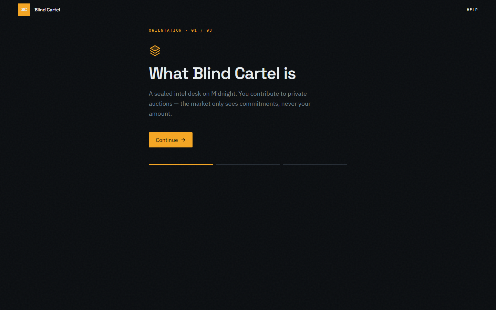
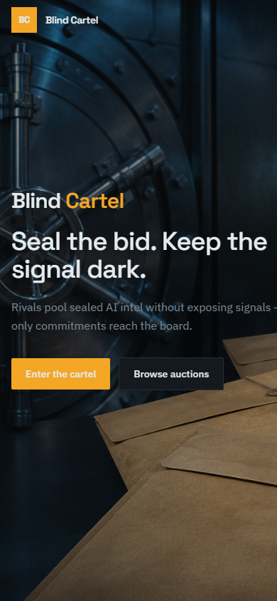

# Blind Cartel

Industry-specific AI intelligence network on [Midnight Network](https://midnight.network). Competing firms contribute sealed bid signals to a shared board — ZK proofs verify each contribution without revealing raw amounts or bidder secrets.

**Live dApp (Preview):** [https://blindcartel.vercel.app](https://blindcartel.vercel.app)

| Level | Codename | Status |
|-------|----------|--------|
| L1 | New Moon | Complete |
| L2 | Waxing Crescent | Complete |
| **L3** | **First Quarter** | **Complete** |

## Screenshots

### Landing (desktop)


### Auction desk (desktop)



### Landing (mobile)



## Preview deployment

| Field | Value |
|-------|--------|
| Network | `preview` |
| Frontend | [blindcartel.vercel.app](https://blindcartel.vercel.app) |
| Contract address | `206dbc664982bd59189123e331d1f0ce5a7b76b238edd4e78e39feb7c15c4457` |
| Indexer | `https://indexer.preview.midnight.network/api/v4/graphql` |
| ZK assets | `/zk/blind-cartel` (served from the web build) |

Config source: [`web/src/config.ts`](web/src/config.ts). Connect **Lace** or **1AM** on **preview**.

## Test output (3 tests passing)

```text
fahmin@Defiance15:~/midnight/blindcartel$ yarn test:local
yarn run v1.22.22
$ MIDNIGHT_NETWORK=undeployed yarn test
$ NODE_OPTIONS='--experimental-vm-modules' vitest run

 RUN  v3.2.4 /home/fahmin/midnight/blindcartel

 ✓ src/test/blind-cartel.test.ts (3)
   ✓ Blind Cartel Contract (3)
     ✓ deploys the contract
     ✓ submits a sealed bid with disclosed commitment only
     ✓ proves bidder ownership without revealing bid amount

 Test Files  1 passed (1)
      Tests  3 passed (3)
   Start at  03:12:41
   Duration  48.27s

Done in 49.12s.
```

Full dump: [`docs/screenshots/test-passing.txt`](docs/screenshots/test-passing.txt).

## Privacy claim

| Data | Visibility | Where |
|------|------------|-------|
| Bid amount | **Private** | Witness + local private state |
| Bidder secret | **Private** | Witness only |
| Bid commitment | **Public** | On-chain `sealedBids` map key |
| Auction ID | **Public** | `SealedBidEntry.auctionId` |
| Bidder commitment | **Public** | `SealedBidEntry.bidderCommitment` |

An observer sees that a sealed bid exists for an auction. They cannot recover the bid amount or raw signal from chain state alone.

## Circuits

| Circuit | Purpose |
|---------|---------|
| `submitSealedBid(auctionId)` | Hash witnesses; disclose commitment + auction metadata |
| `proveBidOwnership(bidCommitment)` | Bidder ZK auth without revealing amount |

## Quick start

```bash
nvm use 22
yarn install
yarn compile
yarn env:up
yarn test:local
yarn sync:zk
yarn web:dev          # http://127.0.0.1:3000
```

| Script | Purpose |
|--------|---------|
| `yarn test:local` | Integration tests on undeployed |
| `yarn deploy:preview` | Deploy contract to preview |
| `yarn web:build` | Production Vite build (`web/` → Vercel root) |
| `yarn sync:zk` | Copy managed ZK assets into `web/public` |

## Project structure

```
contracts/   Compact + managed ZK artifacts
api/         Shared contract helpers for web + node
src/         Wallet, deploy, vitest
web/         React 19 + Vite dApp (Vercel root directory)
```

## Toolchain

| Component | Version |
|-----------|---------|
| Node.js | 22+ |
| Compact | 0.31.1 |
| compact-runtime | 0.16.0 |
| compact-js | 2.5.1 |
| midnight-js | 4.1.1 |
| ledger-v8 | 8.1.0 |

## License

MIT
